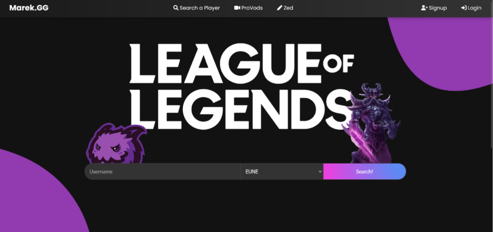
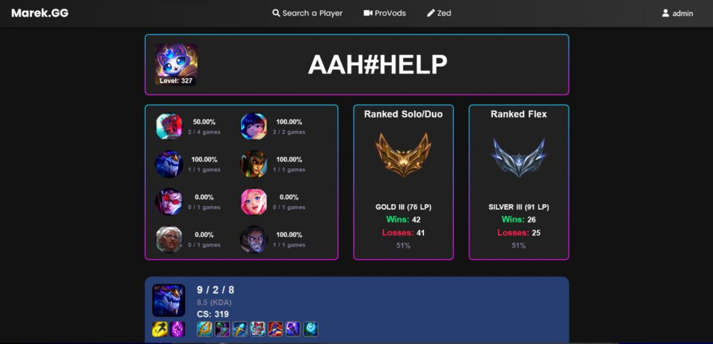
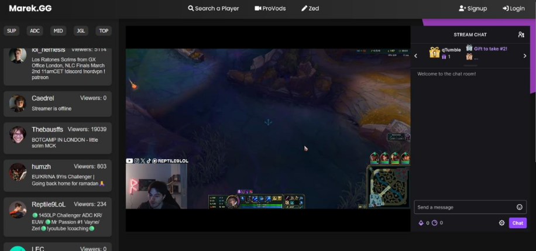
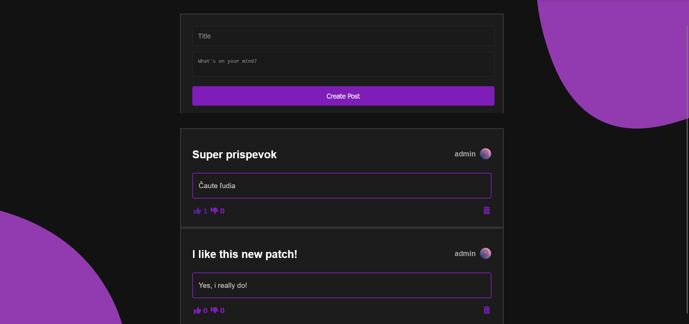
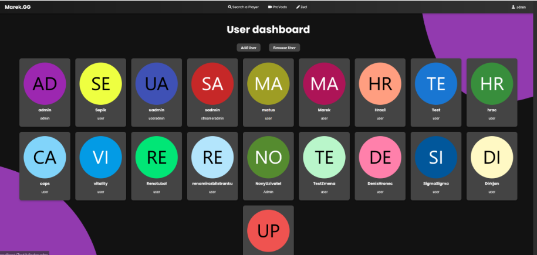
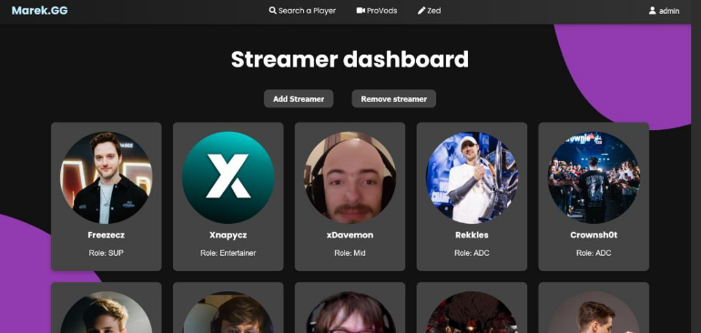
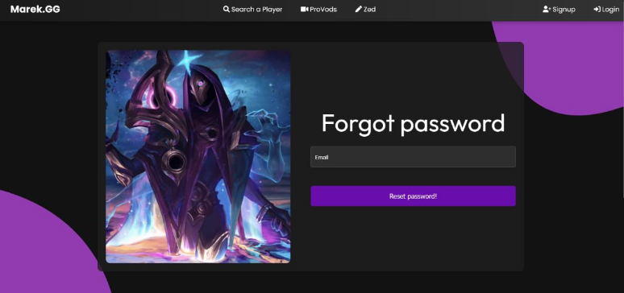

# Marek.GG  

**Marek.GG** is a web platform designed for *League of Legends* enthusiasts, combining competitive insights, real-time streamer discovery, and community engagement in one central hub. Whether you're tracking ranked stats, watching pro players live, or diving into meta discussions, Marek.GG brings it all together.  

*This project was originally developed as my final school assignment at SPŠJM (a technical high school) in Slovakia.*  

---

## 🚀 Features

Click a feature to jump to its section:

- [📊 League of Legends Stats Viewer](#-league-of-legends-stats-viewer)
- [🎥 ProVods – Stream Aggregator](#-provods--stream-aggregator)
- [🗨️ Zed – Community Forum](https://github.com/Dirkisnotavailable/Marek.GG/tree/main?tab=readme-ov-file#%EF%B8%8F-zed--community-forum)
- [🛡️ Admin Panel & User System](#-admin-panel--user-system)

---

### 📊 League of Legends Stats Viewer

View up-to-date statistics for players across all major regions.  
Track player performance, rank progression, and match history with a clean and modern design.  
**[Note: This feature is currently outdated due to changes in the Riot API.]**

---

### 🎥 ProVods – Stream Aggregator

Browse a curated collection of live streams from top League of Legends streamers.  
Watch directly from the platform and stay connected with the scene in real time.  
Admins can manage and moderate which streamers appear on the site.

---

### 🗨️ Zed – Community Forum

Zed is the built-in forum where players can:

- Publish their own posts and content
- Discuss patch notes, champion builds, and meta strategies
- React to posts with upvotes and comments

Built with simplicity and a clean UI in mind.

---

### 🛡️ Admin Panel & User System

Marek.GG includes a fully functional account system and admin interface, offering:

- **User Registration & Login**
- **Session Management**
- **Account Moderation** – Admins can ban or unban users
- **Post Moderation** – Admins can remove posts that violate community guidelines

Security and control were key priorities in building this functionality.

---

## 🛠️ Technologies Used

- **Frontend:** Plain HTML, CSS, and JavaScript (no frameworks)
- **Backend:** PHP
- **API:** Riot Games API
- **Database:** HeidiSQL
- **Hosting:** Provided by [Samo Sadlaker](https://github.com/SamoSadlaker)

---

## 🤝 Contributions

Special thanks to [Samo Sadlaker](https://github.com/SamoSadlaker) for his invaluable support throughout the development of this project.  
His technical guidance and generosity in hosting the website played a key role in bringing Marek.GG to life.

---

## 📬 Contact

**Marek** – [hronecdenis777@gmail.com](mailto:hronecdenis777@gmail.com)  
GitHub: [@Dirkisnotavailable](https://github.com/Dirkisnotavailable)
